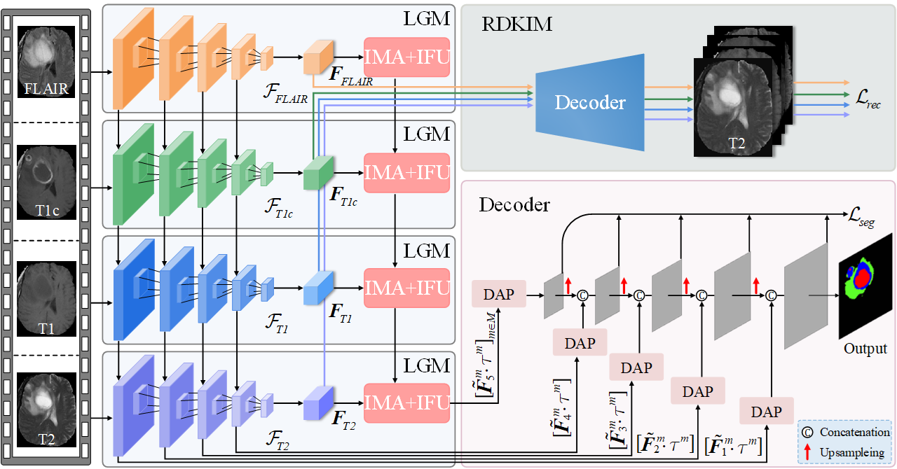

# SRMNet
Multimodal brain tumor segmentaiton with missing modality

We will update the complete code after the paper is accepted!!!

## Dice score (%) on the BraTS2020 dataset

|    ET   |    WT   |    TC   |
|---------|---------|---------|
|   62.2  |   87.0  |   79.2  |

## Architecture of the proposed framework




## Environment


- Python 3.9+
- Torch 2.0+
- cuda_11.6
- ...

## Installation


1. Clone the repository:

   ```shell
   git clone https://github.com/linda0227/SRMNet.git
   
   
## Acknowledgments

We would like to extend our gratitude to the following individuals for their contributions to this project:

- [D3Dnet](https://github.com/XinyiYing/D3Dnet): Thank you for your valuable code contributions and insights.


