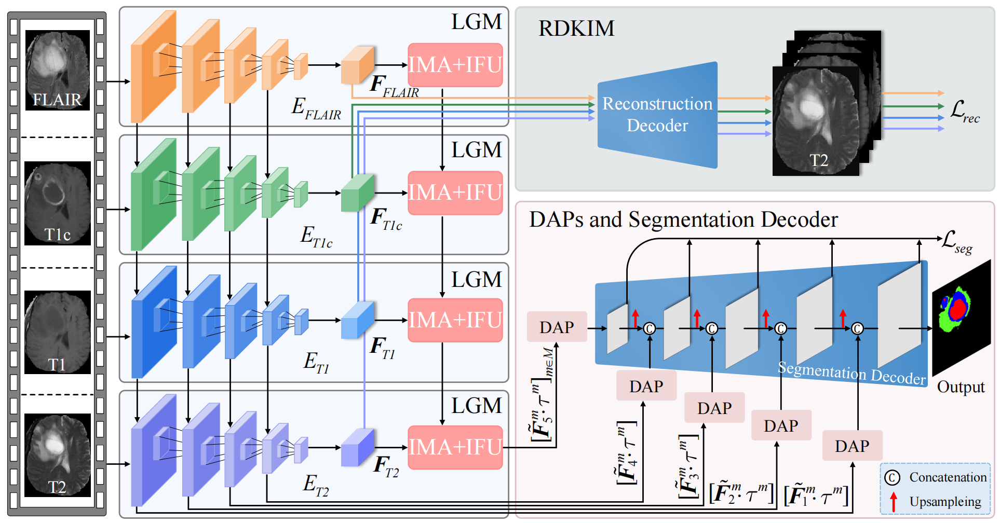

# Deformation-Aware and Reconstruction-Driven Multimodal Representation Learning for Brain Tumor Segmentation with Missing Modalities

We will update the complete code after the paper is accepted!!!


## Architecture of the proposed framework




## Environment


- Python 3.9
- Torch 1.12+
- cuda_11.6
- ...

## Model Weights

Download our trained model weights: [model_last.pth](https://drive.google.com/file/d/17sMQKkh7JBhPiNAzRe6roGhPoyZVn6-J/view?usp=drive_link)

## Installation


1. Clone the repository:

   ```shell
   git clone https://github.com/linda0227/SRMNet.git
   
   
## Acknowledgments

We would like to extend our gratitude to the following project:

- [D3Dnet](https://github.com/XinyiYing/D3Dnet)


